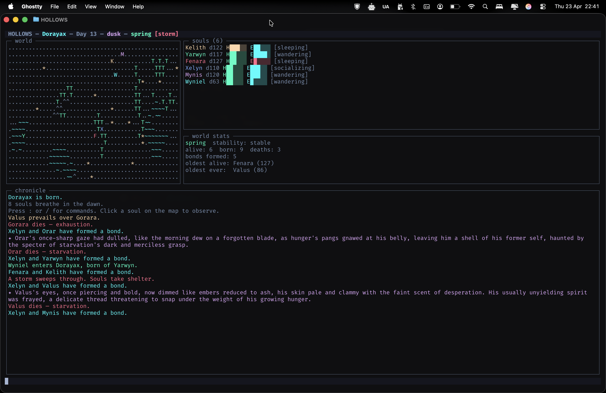

# hollows

A living world simulator that runs in your terminal.

Souls are born, wander, eat, sleep, form bonds, fight, and die — all simulated in real time. Significant moments are narrated by a local AI model via [Ollama](https://ollama.com), so the world generates its own stories without any API costs.



---

## Requirements

- [Node.js](https://nodejs.org) v18+
- [Ollama](https://ollama.com) running locally with at least one model pulled

```
ollama pull llama3.2
```

---

## Setup

```bash
git clone https://github.com/phugadev/hollows
cd hollows
npm install
npm start
```

On first run you'll be asked to name your world. The world is saved automatically and reloads on every subsequent run.

---

## How it works

The simulation runs as a pure code engine — no AI involved in the core loop. Ollama is called only for narrative moments:

| Trigger | Narration |
|---|---|
| A soul nears starvation or death | 1-2 sentence dramatic narration |
| A soul dies | Eulogy based on their life |
| A soul fulfills their life ambition | Moment of quiet triumph |
| A faction forms | Origin story |
| Two souls fight | Conflict scene |
| A world event begins (drought, plague…) | Opening line |
| Two souls form a deep bond | Bond story |
| A wanderer arrives at the world's edge | Arrival narration |
| `observe <name>` / click on map | Inner state narration (or dream narration if sleeping) |
| `ask` | World oracle — Ollama reads the full world state |
| `talk <name>` | Full conversation with a soul in character |

The world keeps running while narrations stream in. Events queue up so nothing is dropped.

---

## Commands

Press `:` or `/` to enter a command.

**Observation**

| Command | Description |
|---|---|
| `observe <name>` | Narrate a soul's inner state (dream if sleeping) |
| `inspect <name>` | Full dossier: stats, relationships, ambition, faction, memory |
| `lineage <name>` | Show parents, self, and children |
| `rumors <name>` | What a soul has heard from others |
| `souls` | List all living souls with faction membership |
| `factions` | List all factions and tension between them |
| `ask` | World oracle — Ollama narrates what's happening right now |
| `history` | Chronicle of significant events since the world began |

**Conversation**

| Command | Description |
|---|---|
| `talk <name>` | Speak directly with a soul — they respond in character |
| `bye` | Leave a conversation |

**Divine intervention**

| Command | Description |
|---|---|
| `feed <name>` | Deliver sustenance to a starving soul |
| `calm <name>` | Bring peace — boosts mood, clears rivalries |
| `smite <name>` | Divine judgment |
| `revive <name>` | Pull a soul back from death (within 5 minutes) |

**World**

| Command | Description |
|---|---|
| `pause` / `resume` | Freeze / unfreeze time |
| `speed <n>` | Speed multiplier — e.g. `speed 2`, `speed 0.5` |
| `model <name>` | Swap Ollama model live — e.g. `model gemma4` |
| `save` | Save world state now |
| `q` | Quit |

Click any soul letter on the map to observe them instantly.

---

## Configuration

Edit `src/config.mjs` to change world size, simulation speed, season length, or the default Ollama model.

```js
export const OLLAMA_MODEL = 'llama3.2'; // swap to 'gemma4' for richer narration
export const WORLD_WIDTH  = 130;
export const WORLD_HEIGHT = 36;
export const SEASON_LENGTH = 20;        // days per season
```

The world state is saved to `world.json` in the project root (gitignored). Delete it to start a new world.

---

## World mechanics

**Souls** have hunger, energy, mood, fulfillment, and three personality traits — boldness, empathy, curiosity — that shape their behaviour. They wander, seek food, sleep, socialise, form rivalries, and carry memories.

**Life stages** — youth (0–20), adult (20–80), elder (80+) — change how souls move and interact. Elders wander slowly but emit a passive wisdom aura that lifts the mood of nearby souls. Elders can also pass memories to younger souls during socialisation.

**Ambitions** — every soul is born with a life goal: forge a deep bond, survive to old age, make five discoveries, have a child, or stand in ancient ruins. Fulfilling an ambition spikes fulfillment and is narrated. Dying with one unfulfilled becomes their regret.

**Trait inheritance** — newborns blend their parents' personality traits with small mutations, creating family character lines over generations.

**Factions** — when three or more souls form a dense web of bonds, they coalesce into a named faction (*Amber Order*, *Stone Kin*, etc.). Factions merge when members bond across groups, and dissolve when membership falls too low. Inter-faction conflicts are flagged in the feed. Use `factions` to see current groups and tension levels.

**Seasons** cycle every 20 days. Winter raises hunger rates and stops births. Spring drops hunger and accelerates bonding.

**World events** — drought, windfall, storm, plague — trigger randomly and reshape conditions for several days.

**Conflict** breaks out when bold souls encounter rivals. Winners and losers are tracked in memory and relationships. Deep grudges can trigger fights even in timid souls.

**Births** happen when two deeply bonded souls are near each other, weighted by season.

**Rumours** spread through the social network — souls share their freshest memory when they socialise, carrying news (and gossip) across the world.

---

## Models

| Model | Size | Character |
|---|---|---|
| `llama3.2` | 2 GB | Fast, capable, good for quick sessions |
| `gemma4` | 9.6 GB | Richer prose, slower on M1 |

Switch mid-session with `model <name>`.

---

## License

MIT
